# AI Pictionary Game

A pictionary game where players try to identify what an AI has drawn. Built with a serverless architecture using SST (Serverless Stack), featuring AI-generated SVG drawings and a beautiful user interface.

## 🎮 How It Works

1. **Start a Game** - Click "New Game" to begin
2. **AI Draws** - AI generates an SVG illustration of a random word
3. **Make Guesses** - You have 5 attempts and 2 minutes to guess the word
4. **Get Hints** - After wrong guesses, the system provides progressive hints
5. **Score Points** - Faster and fewer guesses = higher score
6. **Game Over** - Win by guessing correctly, or lose by running out of time/attempts

## 🌐 Live Demo

The game is deployed and available at: **https://dflbx3kuo9m9d.cloudfront.net/**

### Screenshots


## 🛠️ Technology Stack

### Frontend

- **Next.js 15** - React framework with App Router
- **React 19** - Latest React with concurrent features
- **TypeScript** - Type-safe development
- **Tailwind CSS** - Utility-first CSS framework
- **shadcn/ui** - Beautiful, accessible UI components built on Radix UI

### Backend

- **FastAPI** - Modern, fast Python web framework
- **Python 3.12** - Latest Python runtime
- **AWS Lambda** - Serverless compute
- **API Gateway V2** - REST API management
- **DynamoDB** - NoSQL database for game state
- **OpenAI API** - AI-generated SVG drawings

### Infrastructure

- **SST (Serverless Stack)** - Infrastructure as Code
- **AWS** - Cloud provider
- **pnpm** - Fast, disk space efficient package manager
- **uv** - Ultra-fast Python package installer

## 🏗️ System Architecture

```mermaid
graph TB
    User["👤 Player"] --> CDN["🌐 CloudFront CDN<br/>Next.js App"]

    CDN --> ServerLambda["⚡ Next.js Lambda<br/>SSR/Static Rendering"]
    CDN --> Assets["📦 S3 Bucket<br/>Static Assets"]

    User --> API["🚪 API Gateway<br/>Game API"]

    API --> GameLambda["⚡ FastAPI Lambda<br/>Game Logic"]

    GameLambda --> DB["🗄️ DynamoDB<br/>Game State"]
    GameLambda --> OpenAI["🤖 OpenAI<br/>Generate SVG"]

    subgraph "AWS"
        CDN
        ServerLambda
        Assets
        API
        GameLambda
        DB
    end
```



### Architecture Flow

1. **User Request**: Player visits the game URL, which is served by CloudFront CDN
2. **Content Delivery**: CloudFront delivers the Next.js application (HTML, CSS, JavaScript) and static assets from S3
3. **Server-Side Rendering**: Next.js Lambda handles any server-side rendering and serves the initial page
4. **Client-Side Interaction**: Once loaded in the browser, the React application makes direct API calls to the API Gateway
5. **Game Logic**: API Gateway routes game requests (`/api/game/*`) to the FastAPI Lambda function
6. **Data & AI**: FastAPI Lambda manages game state in DynamoDB and generates SVG drawings using OpenAI API

## 📁 Project Structure

```
pictionary/
├── 📂 web/                  # Frontend (Next.js)
│   ├── 📂 src/              # Source code
│   ├── 📄 package.json      # Frontend dependencies
│   └── 📄 next.config.ts    # Next.js configuration
│
├── 📂 functions/            # Backend API (FastAPI)
│   ├── 📂 src/              # Python source code
│   └── 📄 pyproject.toml    # Python dependencies
│
├── 📂 core/                 # Shared Python utilities
│   ├── 📂 src/              # Core utilities
│   └── 📄 pyproject.toml    # Core dependencies
│
├── 📄 sst.config.ts         # SST infrastructure config
├── 📄 package.json          # Root project scripts
├── 📄 pyproject.toml        # Python workspace config
├── 📄 pnpm-workspace.yaml   # pnpm workspace config
└── 📄 README.md             # This file
```

## 🚀 Local Development

### Prerequisites

1. **Node.js** (>= 22.15.0)
2. **pnpm** (>= 8.0.0)
3. **Python** (3.12.x)
4. **AWS CLI** (configured with credentials)
5. **uv** (Python package manager)

### Initial Setup

1. **Clone the repository**

   ```bash
   git clone https://github.com/shengdade/pictionary
   cd pictionary
   ```

2. **Install dependencies**

   ```bash
   # Install Node.js dependencies
   pnpm install

   # Install Python dependencies
   uv sync
   ```

### AWS Configuration

1. **Configure AWS credentials**

   ```bash
   aws configure
   ```

   Or set environment variables:

   ```bash
   export AWS_ACCESS_KEY_ID=your_access_key
   export AWS_SECRET_ACCESS_KEY=your_secret_key
   export AWS_REGION=us-west-2
   ```

2. **Set up SST secrets**

   ```bash
   # Set OpenAI API key for development
   pnpm sst secret set OpenAIApiKey "your-openai-api-key"

   # For production deployment, set the production stage secret
   pnpm sst secret set OpenAIApiKey "your-openai-api-key" --stage production
   ```

### Development Commands

```bash
# Start development environment (deploys to AWS)
pnpm dev

# Deploy to production
pnpm deploy --stage production

# Remove all resources
pnpm remove

# Manage secrets
pnpm secret list
pnpm secret set KEY value
pnpm secret remove KEY
```
